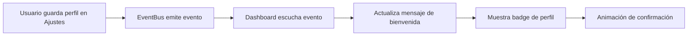

# 👤 Funcionalidad: Actualización de Perfil en Dashboard

## 📋 Descripción

Esta funcionalidad permite que cuando el conductor guarde los cambios de su perfil (nombre y apellido) en la sección de **Ajustes**, estos aparezcan automáticamente en el **Dashboard** sin necesidad de recargar la página.

## ✨ Características Implementadas

### 🔄 **Comunicación en Tiempo Real**
- Utiliza el **EventBus** para comunicación entre componentes
- Actualización inmediata sin recarga de página
- Feedback visual cuando se actualiza el perfil

### 🎨 **Mejoras Visuales**
- **Saludo personalizado** con el nombre del conductor
- **Badge de perfil** con iniciales y nombre completo
- **Animaciones suaves** al actualizar el perfil
- **Notificación temporal** confirmando la actualización

### 📱 **Responsive Design**
- Adaptado para dispositivos móviles
- Estilos optimizados para diferentes tamaños de pantalla

## 🚀 Cómo Funciona

### 1. **Flujo de Actualización**



### 2. **Eventos Implementados**

#### `conductor-profile-updated`
```javascript
// Datos del evento
{
  conductor: {
    nombre: "Juan",
    apellido: "Pérez",
    updatedAt: Date
  },
  nombre: "Juan",
  apellido: "Pérez"
}
```

#### `conductor-config-updated`
```javascript
// Para día libre
{
  conductor: {...},
  configType: "diaLibre",
  value: "lunes"
}

// Para vacaciones
{
  conductor: {...},
  configType: "vacaciones",
  value: { inicio: Date, fin: Date, dias: 15 }
}
```

## 🎯 Componentes Modificados

### **Dashboard.js**
- ✅ Escucha eventos de actualización de perfil
- ✅ Actualiza mensaje de bienvenida dinámicamente
- ✅ Crea y gestiona badge de perfil
- ✅ Animaciones de feedback visual
- ✅ Manejo de estados (con/sin perfil)

### **Ajustes.js**
- ✅ Emite eventos al guardar perfil
- ✅ Emite eventos al actualizar configuración
- ✅ Validación mejorada de datos
- ✅ Feedback de éxito personalizado

### **main.js**
- ✅ Inicialización del EventBus
- ✅ Disponibilidad global del EventBus

## 📖 Uso

### **Para el Usuario:**

1. **Ir a Ajustes** → Perfil del Conductor
2. **Completar** nombre y apellido
3. **Hacer clic** en "Guardar Perfil"
4. **Ver automáticamente** el cambio en el Dashboard:
   - Saludo personalizado: "Buenos días, Juan"
   - Badge con iniciales "JP" y nombre completo
   - Animación de confirmación

### **Para Desarrolladores:**

```javascript
// Escuchar actualizaciones de perfil
window.eventBus.on('conductor-profile-updated', (data) => {
  console.log('Perfil actualizado:', data.conductor);
});

// Emitir actualización manual
window.eventBus.emit('conductor-profile-updated', {
  conductor: { nombre: 'Juan', apellido: 'Pérez' },
  nombre: 'Juan',
  apellido: 'Pérez'
});
```

## 🎨 Estilos CSS Añadidos

```css
.profile-badge {
  display: flex;
  align-items: center;
  gap: 12px;
  margin-top: 16px;
  padding: 12px 16px;
  background: rgba(79, 70, 229, 0.1);
  border: 1px solid rgba(79, 70, 229, 0.2);
  border-radius: 12px;
  transition: all 0.3s ease;
}

.profile-avatar {
  width: 40px;
  height: 40px;
  border-radius: 50%;
  background: var(--accent-primary);
  color: white;
  display: flex;
  align-items: center;
  justify-content: center;
  font-weight: bold;
  font-size: 16px;
}

.profile-name {
  font-weight: 600;
  color: var(--text-primary);
  font-size: 14px;
}

.profile-role {
  font-size: 12px;
  color: var(--text-secondary);
}
```

## 🧪 Testing

Se incluye un archivo de prueba: `test-profile-update.html`

### **Ejecutar Test:**
1. Abrir `test-profile-update.html` en el navegador
2. Hacer clic en los botones de prueba
3. Observar los cambios en tiempo real
4. Verificar el log de eventos

### **Casos de Prueba:**
- ✅ Actualizar perfil con nombre y apellido
- ✅ Limpiar perfil (volver al estado inicial)
- ✅ Múltiples actualizaciones consecutivas
- ✅ Verificar animaciones y feedback visual

## 🔧 Configuración Técnica

### **Dependencias:**
- EventBus.js (sistema de eventos)
- Dashboard.js (componente principal)
- Ajustes.js (configuración de perfil)

### **Compatibilidad:**
- ✅ Chrome/Edge 90+
- ✅ Firefox 88+
- ✅ Safari 14+
- ✅ Dispositivos móviles

## 📝 Notas de Implementación

### **Rendimiento:**
- Los eventos son ligeros y no bloquean la UI
- Las animaciones usan CSS transitions para mejor rendimiento
- El EventBus incluye manejo de errores robusto

### **Accesibilidad:**
- Los cambios de texto son detectados por lectores de pantalla
- Las animaciones respetan `prefers-reduced-motion`
- Contraste adecuado en todos los elementos

### **Mantenimiento:**
- Código modular y reutilizable
- Eventos bien documentados
- Fácil extensión para nuevas funcionalidades

## 🎉 Resultado Final

Cuando el usuario guarda su perfil en Ajustes:

1. **Inmediatamente** ve el cambio en el Dashboard
2. **Recibe confirmación visual** con animaciones suaves
3. **Experimenta** una interfaz más personalizada
4. **No necesita** recargar la página

¡La experiencia de usuario es fluida y profesional! 🚀